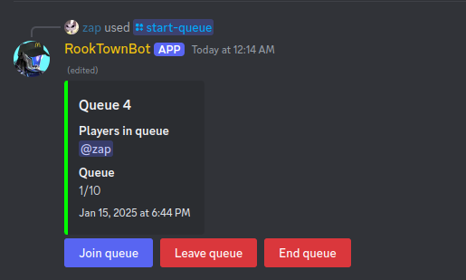
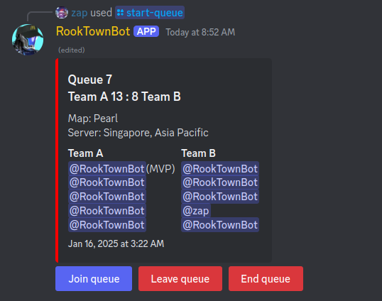
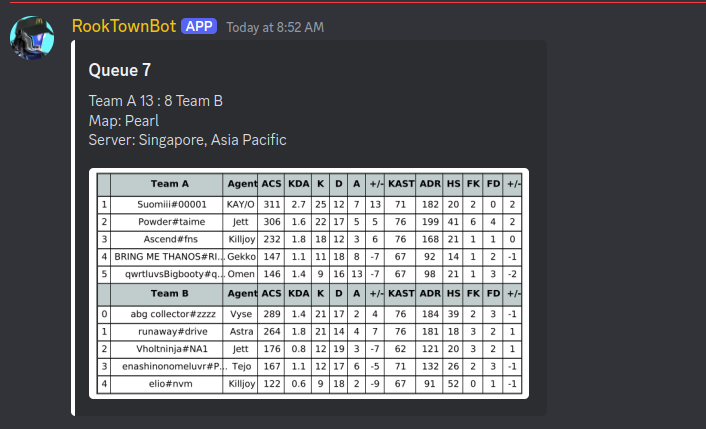
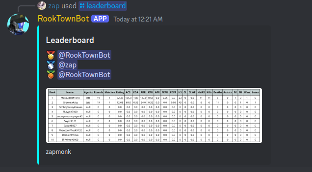

# 👾 RookTownBot

RookTownBot is a Java-based Discord bot designed to manage queues for Valorant custom matches. It provides functionalities for players to join, leave, and end queues, as well as to display match results and update leaderboards.

## ✨ Features

- Join and leave queues
- End queues and display match results
- Update leaderboards with match statistics
- Integration with Henrik-Dev Unofficial Valorant API for player data and match details

## 📸 Screenshots






## 🛠️ Technologies Used

- Java
- Gradle
- SQLite (for database management)

## 🚀 Getting Started

### 📋 Prerequisites

- Java 11 or higher
- Gradle
- A Discord bot token
- Henrik-Dev Valorant API token

### 🛠️ Installation

1. Clone the repository:
    ```sh
    git clone https://github.com/yourusername/RookTownBot.git
    cd RookTownBot
    ```

2. Configure the database:
    - Ensure SQLite is installed and accessible.
    - Update the `DatabaseConfig` class with your database connection details.

3. Configure the bot:
    - Update the `ValorantConfig` class with your Henrik Dev Valorant API token.

4. Build the project:
    ```sh
    gradle build
    ```

5. Run the bot:
    ```sh
    gradle run
    ```

## 📚 Usage

- Use the provided commands to manage queues in your Discord server.
- Ensure the bot has the necessary permissions to read and send messages in the channels.

## 🤝 Contributing

Contributions are welcome! Please fork the repository and create a pull request with your changes.

## 📜 License

This project is licensed under the MIT License. See the `LICENSE` file for details.

## 🙏 Acknowledgements
- [Discord API](https://discord.com/developers/docs/intro)
- [Valorant API](https://github.com/Henrik-3/unofficial-valorant-api)

